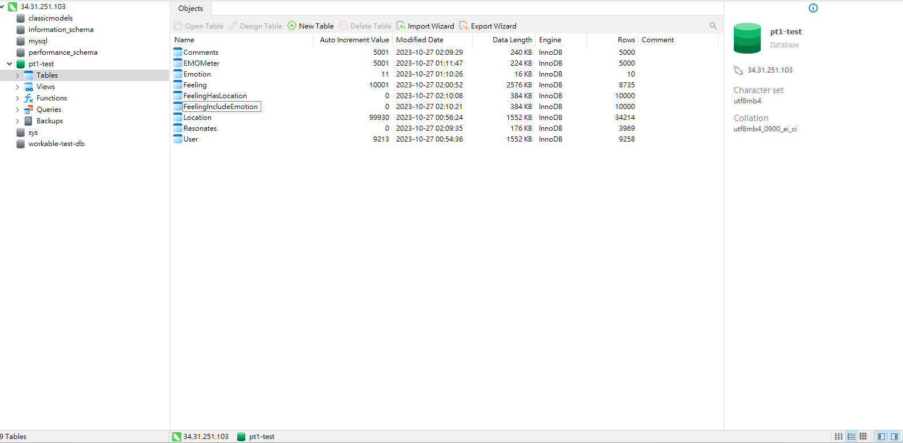

# Stage 3
## Implementing the database tables

## DDL commands
```SQL
DROP TABLE IF EXISTS User;
CREATE TABLE User(
    userID INT AUTO_INCREMENT PRIMARY KEY,
    username VARCHAR(255) UNIQUE NOT NULL,
    password VARCHAR(100) NOT NULL,
    email VARCHAR(255) UNIQUE);

DROP TABLE IF EXISTS Feeling;
CREATE TABLE Feeling(
    feelingID INT AUTO_INCREMENT PRIMARY KEY,
    userID INT NOT NULL,
    content TEXT NOT NULL,
    feelingDate DATETIME NOT NULL,
    FOREIGN KEY (userID) REFERENCES User(userID)
        on delete cascade);

DROP TABLE IF EXISTS Comments;
CREATE TABLE Comments(
    commentID INT AUTO_INCREMENT,
    userID INT NOT NULL,
    feelingID INT NOT NULL,
    content TEXT NOT NULL,
    commentDate DATETIME NOT NULL,
    PRIMARY KEY(commentID, userID, feelingID),
    FOREIGN KEY (userID) REFERENCES User(userID)
        on delete cascade,
    FOREIGN KEY (feelingID) REFERENCES Feeling(feelingID)
        on delete cascade);

DROP TABLE IF EXISTS EMOMeter;
CREATE TABLE EMOMeter(
    EMOID INT AUTO_INCREMENT PRIMARY KEY,
    userID INT,
    EMOValue INT,
    EMODate DATETIME,
    FOREIGN KEY (userID) REFERENCES User(userID)
        on delete cascade);

DROP TABLE IF EXISTS Emotion;
CREATE TABLE Emotion(
    emotionID INT AUTO_INCREMENT PRIMARY KEY,
    content TEXT);

DROP TABLE IF EXISTS FeelingIncludeEmotion;
CREATE TABLE FeelingIncludeEmotion(
    feelingID INT NOT NULL,
    emotionID INT NOT NULL,
    PRIMARY KEY (feelingID, emotionID),
    FOREIGN KEY (feelingID) REFERENCES Feeling(feelingID)
        on delete cascade,
    FOREIGN KEY (emotionID) REFERENCES Emotion(emotionID)
        on delete cascade);

DROP TABLE IF EXISTS Location;
CREATE TABLE Location(
    LocationID INT AUTO_INCREMENT PRIMARY KEY,
    nation varchar(255),
    province varchar(255),
    city varchar(255));

DROP TABLE IF EXISTS FeelingHasLocation;
CREATE TABLE FeelingHasLocation(
    feelingID INT NOT NULL UNIQUE,
    locationID INT NOT NULL,
    PRIMARY KEY (feelingID, locationID),
    FOREIGN KEY (feelingID) REFERENCES Feeling(feelingID)
        on delete cascade,
    FOREIGN KEY (locationID) REFERENCES Location(locationID)
        on delete cascade);

DROP TABLE IF EXISTS Resonates;
CREATE TABLE Resonates(
    userID INT NOT NULL,
    feelingID INT NOT NULL,
    type INT,
    PRIMARY KEY (feelingID, userID),
    FOREIGN KEY (feelingID) REFERENCES Feeling(feelingID)
        on delete cascade,
    FOREIGN KEY (userID) REFERENCES User(userID)
        on delete cascade);
```

## Table overview


## Advanced SQL Queries
### Query 1
Retrieves the count of a particular type of reaction (in this case reaction type is 2) along with the corresponding content for each post. This query will be heavily utilized during data analysis.

```sql
SELECT COUNT(*) as cnt, Feeling.content
FROM Resonates
LEFT JOIN `Feeling` on Resonates.`feelingID` = Feeling.`feelingID`
WHERE Resonates.type = 2
GROUP BY Resonates.feelingID
ORDER BY cnt DESC;
```


### Query 2
Retrieves the count of a particular type of EMOValue (in this case EMOValue is 10) along with the username for each user. From this query, we can analyze the psychological state of specific individuals.
```sql
SELECT COUNT(*) as cnt, User.username as names
FROM EMOMeter
NATURAL JOIN User
WHERE EMOMeter.EMOValue = 10
GROUP BY EMOMeter.userID
ORDER BY cnt DESC;
```


### Query 3
Gets all the posts that have similar emotion to user's(in this case user with userID 676) last post(Feeling).
```sql
SELECT *
FROM Feeling NATURAL JOIN FeelingIncludeEmotion
WHERE
     emotionID = (
     SELECT emotionID
     FROM Feeling NATURAL JOIN FeelingIncludeEmotion
     WHERE userID = 676
     ORDER BY feelingDate DESC
     LIMIT 1
)
ORDER BY feelingDate DESC
```


### Query 4
Get an ordered count of the types of reactions(Resonates) a given user(in this case user with userID 8133) has reacted in their last 10 reactions.
```sql
SELECT type, Count(type) as count
FROM (SELECT *
      FROM Resonates
      WHERE userID = 8133
      LIMIT 10) as user_likes
GROUP BY type
ORDER BY count DESC
```
There are less then 15 results for this query.\

### Query 5
Get a list of the most common types reactions(Resonates) each user leaves.
```sql
SELECT userID, MAX(c) as type
FROM (SELECT userID, COUNT(type) as c
     FROM Resonates
     GROUP BY userID, type) as user_likes
GROUP BY userID
ORDER BY userID
```


## Indexing Analysis
### Query 1
```sql
SELECT COUNT(*) as cnt, Feeling.content
FROM Resonates
LEFT JOIN `Feeling` on Resonates.`feelingID` = Feeling.`feelingID`
WHERE Resonates.type = 2
GROUP BY Resonates.feelingID
ORDER BY cnt DESC;
```
#### Initial EXPLAIN ANALYZE:


#### Set Resonates(type) as index
```sql 
CREATE INDEX idx ON Resonates(type);
```
.png)


#### Set Resonates(feelingID) as index
```sql 
CREATE INDEX idx ON Resonates(feelingID);
```
.png)


#### Set Resonates(userID) as index
```sql 
CREATE INDEX idx ON Resonates(userID);
```
.png)

### Query 2
```sql
SELECT COUNT(*) as cnt, User.username as names
FROM EMOMeter
NATURAL JOIN User
WHERE EMOMeter.EMOValue = 10
GROUP BY EMOMeter.userID
ORDER BY cnt DESC;
```

#### Initial EXPLAIN ANALYZE:


#### Set EMOMeter(EMOValue) as index
```sql 
CREATE INDEX idx ON EMOMeter(EMOValue);
```
.png)

#### Set EMOMeter(EMOID) as index
```sql 
CREATE INDEX idx ON EMOMeter(EMOID);
```
.png)

#### Set EMOMeter(userID) as index
```sql 
CREATE INDEX idx ON EMOMeter(userID);
```
.png)

### Query 3
```sql
SELECT *
FROM Feeling NATURAL JOIN FeelingIncludeEmotion
WHERE
     emotionID = (
     SELECT emotionID
     FROM Feeling NATURAL JOIN FeelingIncludeEmotion
     WHERE userID = 676
     ORDER BY feelingDate DESC
     LIMIT 1
)
ORDER BY feelingDate DESC
```

#### Initial EXPLAIN ANALYZE:


#### Set Feeling(userID) as index

```sql
CREATE INDEX id ON Feeling(userID);
```
.png)

#### Set Feeling(feelingID) as index
```sql
CREATE INDEX id ON Feeling(feelingID);
```

.png)


#### Set Feeling(feelingDate) as index
```sql
CREATE INDEX id ON Feeling(feelingDate);
```
.png)

## Query 4

```sql
SELECT type, Count(type) as count
FROM (SELECT *
      FROM Resonates
      WHERE userID = 8133
      LIMIT 10) as user_likes
GROUP BY type
ORDER BY count DESC
```
#### Initial EXPLAIN ANALYZE:


#### Set Resonates(feelingID, userID) as index
```sql
CREATE INDEX idx ON Resonates(feelingID, userID);
```

.png)

#### Set Resonates(type) as index
```sql
CREATE INDEX idx ON Resonates(type);
```

.png)


#### Set Resonates(userID) as index
```sql
CREATE INDEX idx ON Resonates(userID);
```

.png)

#### Set Resonates(feelingID) as index
```sql
CREATE INDEX idx ON Resonates(feelingID);
```

.png)


## Query 5
```sql
SELECT userID, MAX(c) as type
FROM (SELECT userID, COUNT(type) as c
     FROM Resonates
     GROUP BY userID, type) as user_likes
GROUP BY userID
ORDER BY userID
```

#### Initial EXPLAIN ANALYZE:


#### Set Resonates(userID) as index
```sql
CREATE INDEX idx ON Resonates(userID);
```
.png)

#### Set Resonates(feelingID) as index
```sql
CREATE INDEX idx ON Resonates(feelingID);
```

.png)


#### Set Resonates(feelingID, userID) as index
```sql
CREATE INDEX idx ON Resonates(feelingID, userID);
```
.png)


#### Set Resonates(type) as index
```sql
CREATE INDEX idx ON Resonates(type);
```
.png)


### Indexing Analysis Discussion
We consulted with the teaching assistant, who advised us to use “cost” as a basis for discussing whether to add an index. This is because the “actual time” in the EXPLAIN ANALYZE output can be significantly influenced by a variety of factors.
#### Query 1
We have decided to add Resonates(type) as the index when executing query 1. From the experimental results, we can observe a significant reduction in cost at every stage. Furthermore, since Resonates(type) is neither a foreign key nor a primary key, and our query requires searching for specific values of Resonates.type, using it as an index can effectively reduce the cost. As for the other experiments involving Resonates(feelingID) and Resonates(userID), these are already primary keys, which explains why there was no reduction in cost in the experimental results. 

#### Query 2
From the experimental results, we can see that when we add EMOMeter(EMOValue) as the index, there is a significant reduction in cost at each stage. Although the actual time has increased, following the guidance of the Teaching Assistant (TA), we have decided to focus our evaluation on cost. Therefore, we have decided to add EMOMeter(EMOValue) as the index when executing query 2. Moreover, since Resonates(type) is neither a foreign key nor a primary key, and our query requires searching for specific values of EMOMeter.EMOValue, using it as an index can effectively reduce the cost.

#### Query 3, 4, 5
We decided not to add any indexes, as the experimental results showed that adding indexes did not change the cost of our query. Additionally, nearly every attribute of the tables we used is already a primary key or foreign key in the schema. Therefore, adding them as a key would not enhance performance. This was validated through our experiments.

