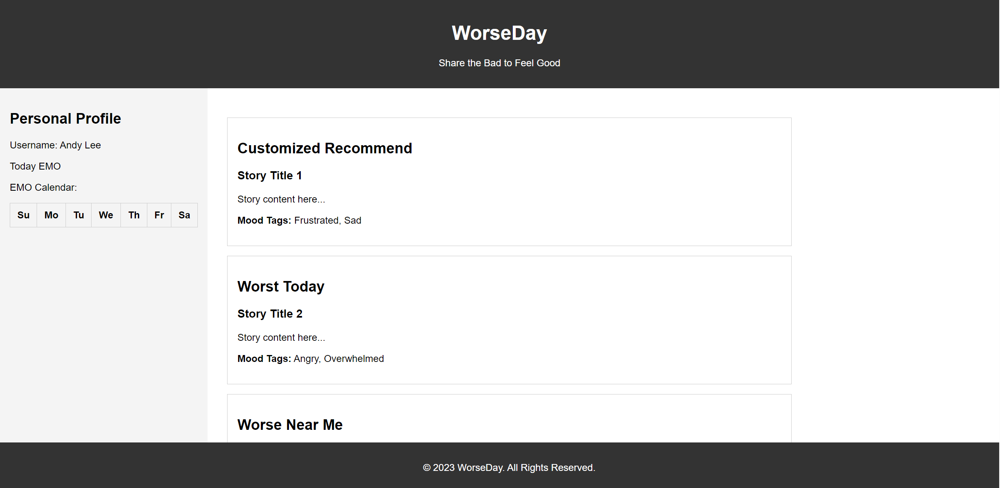

# WorseDay: Share the Bad to Feel Good

## Project Summary

**WorseDay** is an emerging project aimed at creating a communal space where people can share stories about their bad days. As (mostly)graduate students in computer science, we recognize the emotional toll that a challenging day can take. We believe that sharing these experiences can offer a unique form of emotional relief. 

The project is in its infancy, but the vision is clear: to build a platform that not only allows for the sharing of individual stories but also fosters a sense of community. Through features like mood tags, commenting, and our experimental "Mood Meter," we aim to make WorseDay a go-to platform for emotional support and community engagement.

## Description

The primary objective of **WorseDay** is to offer a dedicated platform for sharing bad day stories. Users can post their experiences, categorized by mood tags like "Frustrated," "Sad," or "Angry." This categorization will help users find stories that resonate with them, offering a more personalized experience.

In addition to story sharing, we're committed to creating a safe and supportive environment. We plan to implement a robust moderation system that includes both automated filters for inappropriate content and a reporting feature for users. This ensures that the platform remains a positive space for genuine sharing and support.

## Usefulness

While platforms like Reddit offer various spaces for sharing personal stories, **WorseDay** aims to specialize in the sharing of bad day experiences. This focus allows us to offer features tailored to this specific type of content, such as mood tags and a "Mood Meter," which could provide real-time mood analytics of the community.

The "Mood Meter" is a feature we're particularly excited about. It could offer users a unique way to engage with the platform, providing a real-time mood score based on the stories shared each day. This feature sets us apart from other general story-sharing platforms and adds an extra layer of interactivity and community engagement.

### Existing Solution
#### Twitter vs. WorseDay
##### What's it about?
- Twitter: Quick thoughts, like "Just had coffee!" or "Rain again?!"
- WorseDay: Epic tales of bad days. Think "My coffee spilled all over my white shirt, and then it rained!"
##### How do people chat?
- Twitter: Likes, retweets, and short replies. Super fast-paced!
- WorseDay: Dive deep into feelings with mood tags and the super-cool "Mood Meter."
##### Cool stuff:
- Twitter: Trends, polls, and pics.
- WorseDay: Mood tags and the "Mood Meter" – like a mood ring for the whole community!
#### Reddit vs. WorseDay
##### What's it about?
- Reddit: Everything under the sun, from cats to spaceships.
- WorseDay: The drama of bad days, and oh boy, we all have 'em!
##### How do people chat?
- Reddit: Upvotes, downvotes, and long chats.
- WorseDay: Dive into the sea of feelings with mood tags and the epic "Mood Meter."
##### Cool stuff:
- Reddit: Awards and fun Q&A sessions.
- WorseDay: Mood tags and the "Mood Meter" – it's like the heartbeat of the community!

#### Conclusion
While Twitter and Reddit are established platforms with broad user bases and diverse content, WorseDay offers a specialized niche for users to share and engage with stories about bad days. Its unique features, like the "Mood Meter," set it apart and cater to its target audience's specific needs. If executed well, WorseDay could fill a gap in the market for those seeking a dedicated space to share, relate, and find solace in communal experiences.

## Realness of Data

In the initial phase of the project, our primary data source will be curated posts from social media platforms like Twitter and Reddit. We plan to use the respective APIs of these platforms to fetch posts that are tagged with specific keywords or hashtags related to bad days, such as `#badday`, `#worstdayever`, etc. This approach will allow us to populate WorseDay with relevant content while the user base is still growing.

### Data Collection Strategy:

1. **Twitter**: Download Tweeter's past tweet with emotion tag. The data will include the target, id, date, flag, user, text.
    - **Kaggle**: Sentiment140 dataset with 1.6 million tweets

2. **Reddit**: Download Reddit's past post with emotion tag.
    - **Kaggle**: Twitter and Reddit Sentimental analysis Dataset
    

### Data Authenticity:

To ensure the authenticity and quality of the data, we will implement a filtering mechanism that only selects posts with a certain level of engagement (likes, retweets, upvotes, etc.) and discards posts that contain inappropriate or irrelevant content.

### User-Generated Content:

As the platform gains traction, we expect the proportion of user-generated content to increase, eventually making it the primary source of data. At that point, the platform will transition from curated content to a self-sustaining ecosystem of user-generated stories.

## Database Schema

### Data Stored in Database

- **User Information**: This will include basic but essential data like username, hashed password, and email for account recovery and authentication. Each email will serve as a unique identifier for user accounts.

- **Stories**: Stories will be stored with a unique ID for easy retrieval, along with associated user IDs for accountability. Each story will also feature mood tags for categorization and a timestamp for chronological sorting.

- **Comments**: Comments will be stored with unique IDs and will be associated with both user IDs and story IDs. This structure will allow for nested comments, enabling more organized and meaningful discussions.

- **Upvotes**: Upvotes will be tracked using both user IDs and story IDs. This will allow us to prevent multiple upvotes from a single user on the same story.

- **Mood Meter**: The Mood Meter will store a daily mood score, calculated based on the mood tags associated with the stories shared each day. Each score will be timestamped for historical tracking.

## Functionality

### Basic Functions

1. **User Authentication**: The platform will offer basic but secure user authentication features. Users can register with an email and password, which will be verified through a confirmation email. Once registered, users can log in to access the platform's features.

2. **Post Stories**: Registered users will have the ability to post their own bad day stories. Each story can be tagged with one or more mood tags, allowing for easier categorization and searchability. Stories will also feature timestamps, providing a chronological context.

3. **Comment**: Users can comment on stories to offer support, share similar experiences, or engage in community discussions. The commenting system will allow for nested comments, providing a more organized structure for discussions.

4. **Upvote**: Users can upvote both stories and comments. Upvotes serve as a simple but effective way to gauge community sentiment and will influence the visibility and ranking of stories on the platform.

5. **Search**: A search function will allow users to find stories based on mood tags, keywords, or usernames. This feature will employ a full-text search algorithm to ensure efficiency and accuracy.

### Complex Functions

1. **Mood Meter**: The Mood Meter is an experimental feature that aims to gauge the collective mood of the community. It will analyze the mood tags associated with the stories shared each day to calculate a daily mood score. This score will be displayed on the platform, offering a unique form of community engagement.

2. **Personalized Suggestions**: As a future enhancement, we plan to implement a feature that suggests stories to users based on their past activity and the mood tags they interact with most frequently. This will be achieved through basic machine learning algorithms and will offer a more personalized user experience.

## Creative Component

### "Mood Meter"

The Mood Meter is a feature we're particularly excited about. It offers a unique way to engage with the community by providing a real-time mood score based on the stories shared. We plan to implement this feature using basic text analysis techniques, possibly expanding to more advanced Natural Language Processing methods as the project evolves.

## Low-Fidelity UI Mockup

## Project Work Distribution

1. **Frontend Development**: Andy Lee, Yu-Min Liu
    - **Responsibilities**: Implementing the basic UI/UX design.
    - **Tools**: HTML, CSS, and JavaScript.
  
2. **Backend Development**: Chun-Yi Lee, Peter Bremer-Feit, Andy Lee
    - **Responsibilities**: Setting up the server, developing the API, and managing the database.
    - **Tools**: Flask for the backend framework and MySQL for the database.

3. **Data Analysis and Mood Meter**: Yu-Min Liu
    - **Responsibilities**: Developing the Mood Meter feature, including text analysis and mood score calculation.
    - **Tools**: Python for text analysis and mood score algorithms.

### Backend Systems Distribution

- **User Authentication**: Peter Bremer-Feit
    - **Tools**: Flask for the backend framework, MySQL for storing user data, and JWT for token-based authentication.
  
- **Story Posting and Retrieval**: Chun-Yi Lee
    - **Tools**: Flask and MySQL for storing and retrieving stories.
  
- **Commenting and Upvoting**: Peter Bremer-Feit
    - **Tools**: Flask and MySQL for comment and upvote functionality.
  
- **Mood Meter Algorithm**: Andy Lee
    - **Tools**: Python for text analysis and mood score calculation.
